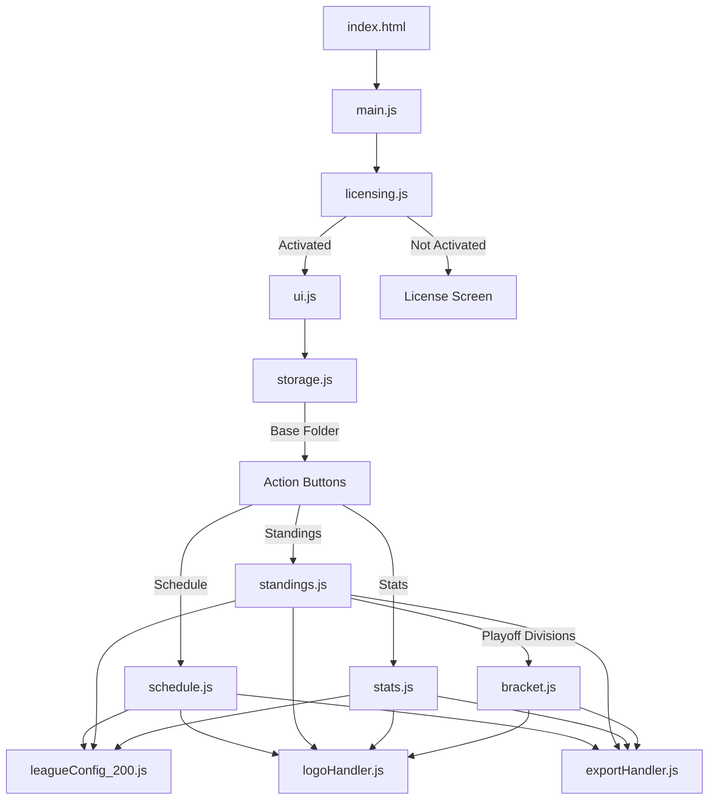
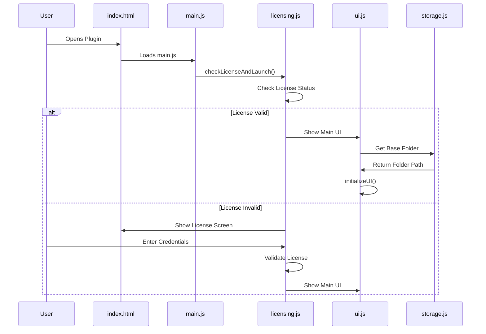
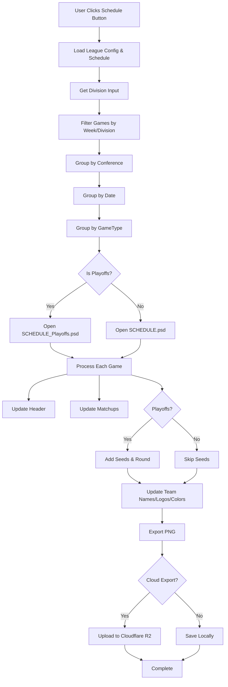
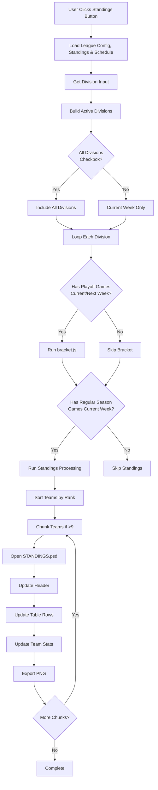
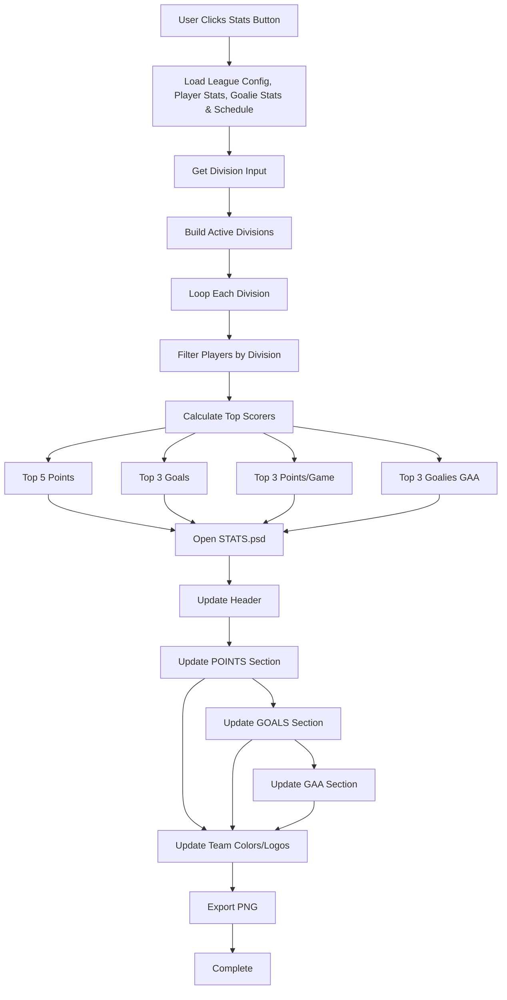
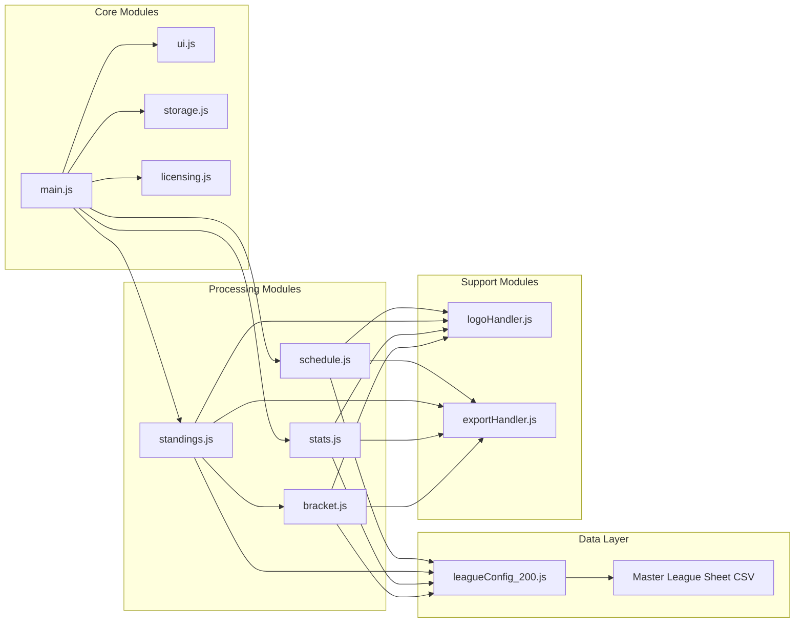
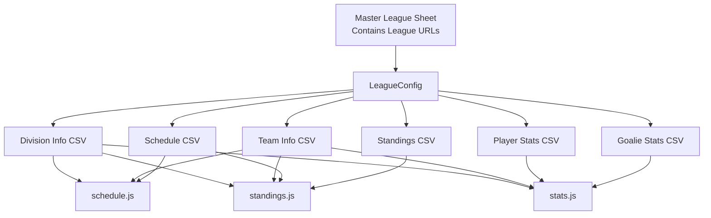

# Plugin Architecture & Flow

This document provides a visual representation of the codebase structure and data flow.

## High-Level Architecture

## Detailed Data Flow

### 1. Initialization Flow

### 2. Schedule Update Flow

### 3. Standings Update Flow

### 4. Stats Update Flow

## Module Dependencies

## Data Sources

## Key Functions by Module

### main.js
- Entry point
- Event listeners for UI buttons
- Routes to Schedule/Standings/Stats modules

### leagueConfig_200.js
- `getLeagueCsvUrls()` - Gets URLs from master sheet
- `loadLeagueConfig()` - Loads division/team/conference data
- `loadSchedule()` - Loads schedule data
- `loadStandings()` - Loads standings data
- `loadPlayerStats()` - Loads player stats
- `loadGoalieStats()` - Loads goalie stats
- `getUserDivision()` - Converts division input

### schedule.js
- `handleScheduleUpdate()` - Main schedule processing
- Groups games by conference/date/type
- Handles playoff vs regular season templates
- Updates team names, logos, scores, seeds

### standings.js
- `handleStandingsUpdate()` - Main standings processing
- Detects playoff divisions
- Routes to bracket.js for playoffs
- Processes regular season standings
- Chunks large divisions

### bracket.js
- `handleBracketUpdate()` - Bracket processing
- Opens BRACKET.psd template
- Updates header information
- Exports bracket graphics

### stats.js
- `handleStatsUpdate()` - Main stats processing
- Calculates top scorers/goalies
- Updates POINTS, GOALS, GAA sections

### logoHandler.js
- `buildLogoSource()` - Determines logo source (CDN vs local)
- `replaceLogo()` - Replaces logos in Photoshop
- `clearLogoCache()` - Clears cached logos

### exportHandler.js
- `exportPng()` - Exports PNG files
- `buildCdnPath()` - Builds CDN path
- `uploadToR2()` - Uploads to Cloudflare R2

### ui.js
- `initializeUI()` - Initializes UI state
- `updateDivisionDisplay()` - Updates division display
- `updateActionButtons()` - Enables/disables buttons

### storage.js
- `selectAndSaveBaseFolder()` - Folder selection
- `getBaseFolder()` - Gets saved folder

### licensing.js
- `checkLicenseAndLaunch()` - License validation
- `handleActivation()` - License activation
- `logoutUser()` - User logout

## Viewing This Diagram

You can view these Mermaid diagrams in:
1. **GitHub/GitLab** - Renders automatically in markdown
2. **VS Code** - Install "Markdown Preview Mermaid Support" extension
3. **Online** - Copy diagram code to https://mermaid.live/
4. **Documentation tools** - Most markdown renderers support Mermaid

## Notes

- All three main workflows (Schedule, Standings, Stats) share the same data loading pattern
- Standings can route to Bracket for playoff divisions
- Logo handling supports both CDN and local file sources
- Export can go to local filesystem or Cloudflare R2
- League configuration is cached for performance
- Division input supports abbreviations, full names, or "ALL"

